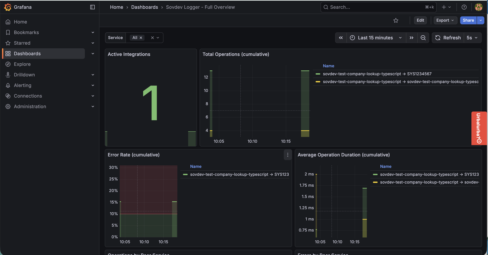
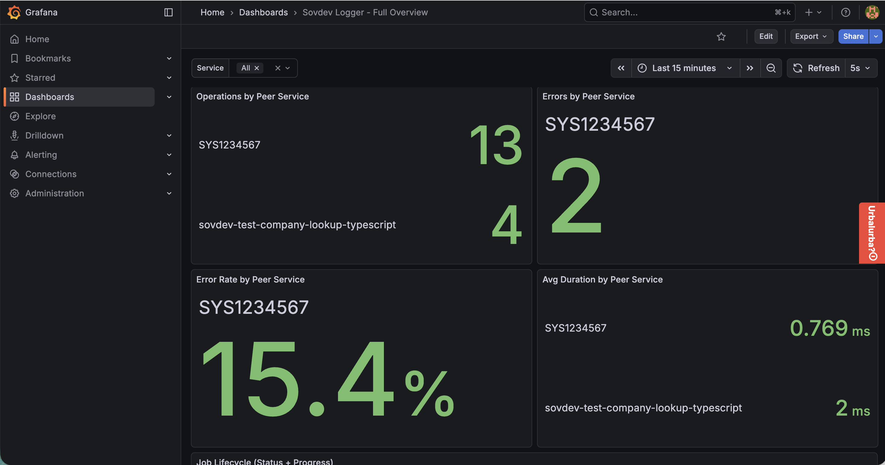
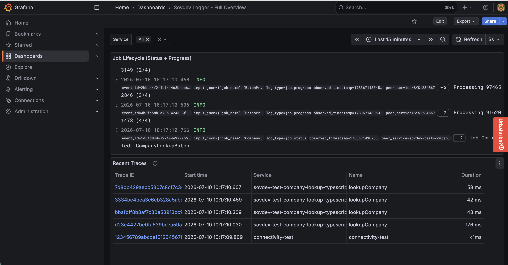
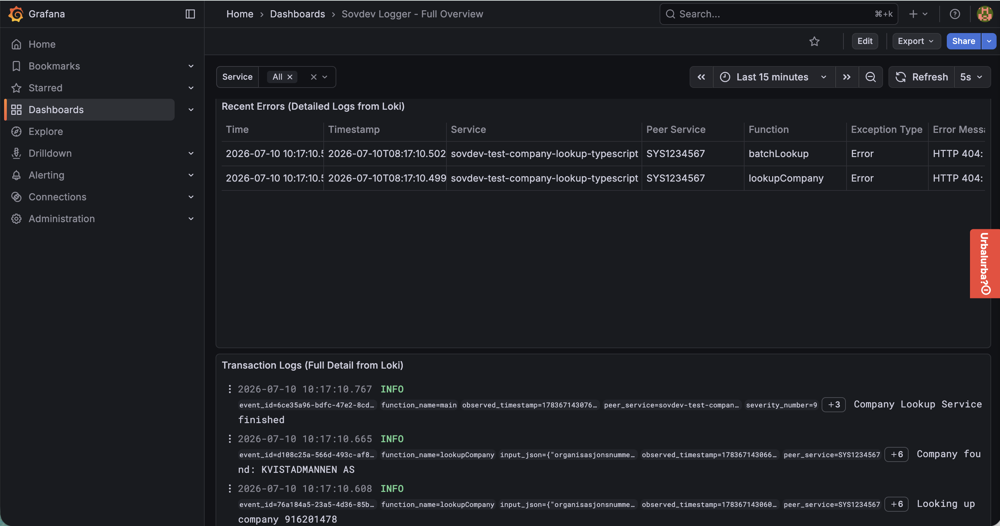

# Dashboard walkthrough

Every panel on this dashboard comes from the same test program — [`company-lookup.ts`](https://github.com/helpers-no/sovdev-logger/blob/main/typescript/test/e2e/company-lookup/company-lookup.ts), sovdev-logger's reference E2E scenario. This page walks through the dashboard top to bottom, pairing each panel with the exact `sovdev_log*()` call that produced it — real screenshots, real code, no invented examples.

## Try it yourself

> This reproduces the exact run behind the screenshots below, using the sovdev-logger repo's own DevContainer and local UIS (Loki/Prometheus/Tempo/Grafana) stack — not something available from just installing the published package. See [Environment configuration](https://sovdev-logger.sovereignsky.no/contributor/environment-configuration) for that setup. If you're only using the library in your own application, skip to the panel explanations below — they apply just as well to a dashboard you build against your own Grafana.

```bash
dct-exec bash -c "cd /workspace/typescript/test/e2e/company-lookup && bash run-test.sh --skip-validation"
```

Then open the dashboard (this is the one built and pushed in [`tools/dashboards/`](https://github.com/helpers-no/sovdev-logger/tree/main/tools/dashboards), not the UIS-provisioned one — see [Observability architecture](../observability-architecture.md) for that one):

```
http://grafana.localhost/d/sovdev-logger-full/sovdev-logger-full-overview
```

Traces take 20-40 seconds to become searchable after a run (a Tempo indexing characteristic, not a bug) — if the Recent Traces panel is empty right after running the test, wait a bit and refresh.

---

## The scenario

`company-lookup.ts`'s `main()` looks up 4 Norwegian organizations from the Brønnøysund Registry (BRREG), one of which is intentionally invalid to demonstrate error handling:

```typescript
const companies = [
  '971277882', // Norges Røde Kors (Norwegian Red Cross)
  '915933149', // Røde Kors Hjelpekorps (Red Cross Rescue Corps)
  '974652846', // INVALID - Will cause error (demonstrates error handling)
  '916201478'  // Norsk Folkehjelp (Norwegian People's Aid)
];
```

Everything below comes from this one run.

---

## Active Integrations, Total Operations, Error Rate, Avg Duration



These four panels are **automatic** — there's no separate metrics code anywhere in `company-lookup.ts`. Every `sovdev_log()` call generates `sovdev_operations_total`, `sovdev_errors_total`, and `sovdev_operation_duration_milliseconds` behind the scenes, labeled by `service_name` and `peer_service`. Write one log call, get a counter, an error counter, and a duration histogram for free — this is the "one log call, complete observability" idea the library is built around.

---

## Operations / Errors / Error Rate / Avg Duration by Peer Service



Same underlying metrics as above, grouped by `peer_service` instead of summed together — this is sovdev-logger's service-dependency data. The `SYS1234567` you see here is BRREG's system ID, passed as `PEER_SERVICES.BRREG` to every `sovdev_log()` call inside `lookupCompany()`:

```typescript
const PEER_SERVICES = create_peer_services({
  BRREG: 'SYS1234567'  // Norwegian company registry (Brønnøysundregistrene)
  // INTERNAL is auto-generated with value 'internal'
});
```

```typescript
sovdev_log(
  SOVDEV_LOGLEVELS.INFO,
  FUNCTIONNAME,
  `Looking up company ${orgNumber}`,
  PEER_SERVICES.BRREG,   // <- this is the label these panels group by
  input,
  null,
  null
);
```

That single argument is what lets sovdev-logger build a dependency map automatically — every external system your service calls shows up here, broken out from your service's own internal operations, with no extra instrumentation. (The code comment above says `PEER_SERVICES.INTERNAL` is `'internal'` — that's stale. It actually resolves to your own `service_name`, which is what you'll see as the `peer_service` value on the Job Lifecycle panel's "Job Completed" entry below.)

---

## Job Lifecycle (Status + Progress)



Batch jobs get their own log type, tracked with two dedicated functions. `sovdev_log_job_status()` marks the start and end of the whole batch:

```typescript
sovdev_log_job_status(
  SOVDEV_LOGLEVELS.INFO,
  FUNCTIONNAME,
  jobName,              // 'CompanyLookupBatch'
  'Started',            // job lifecycle state
  PEER_SERVICES.INTERNAL,
  jobStartInput          // { totalCompanies: 4 }
);
```

`sovdev_log_job_progress()` logs one entry per item as the batch processes:

```typescript
sovdev_log_job_progress(
  SOVDEV_LOGLEVELS.INFO,
  FUNCTIONNAME,
  orgNumber,          // Item name (what we're processing)
  i + 1,              // Item number (current position, 1-based)
  orgNumbers.length,  // Total items (batch size)
  PEER_SERVICES.BRREG,
  progressInput
);
```

Both set `log_type` automatically (`job.status` / `job.progress`) — this panel filters on `log_type=~"job.status|job.progress"` and shows them in chronological order, so the whole lifecycle reads top to bottom: Started → Processing 1/4 → 2/4 → 3/4 → 4/4 → Completed.

## Recent Traces

Distributed tracing here needs zero OpenTelemetry imports. `lookupCompany()` starts a span once, and every `sovdev_log()` call inside it automatically inherits the same `trace_id`/`span_id`:

```typescript
const span = sovdev_start_span(FUNCTIONNAME, input);

try {
  sovdev_log(/* ... start ... */);
  const companyData = await fetchCompanyData(orgNumber);
  sovdev_log(/* ... success ... */);
  sovdev_end_span(span);
} catch (error) {
  sovdev_log(/* ... error, with the exception ... */);
  sovdev_end_span(span, error);   // marks the span as failed
  throw error;
}
```

Each of the 4 `lookupCompany` calls produces one trace here, including the failed lookup (`974652846`) — it's not excluded just because it errored. Click its Trace ID to open the full waterfall, where the failing span is marked in red.

---

## Recent Errors / Transaction Logs



The intentional failure (org number `974652846`, which doesn't exist in BRREG) produces sovdev-logger's error path — `sovdev_log()` at `ERROR` level with the caught exception passed as the last argument:

```typescript
sovdev_log(
  SOVDEV_LOGLEVELS.ERROR,
  FUNCTIONNAME,
  `Failed to lookup company ${orgNumber}`,
  PEER_SERVICES.BRREG,
  input,
  null,      // no response on error
  error      // <- sovdev-logger extracts exception_type/message/stacktrace from this
);
```

sovdev-logger turns that `error` argument into `exception_type` (the thrown value's own constructor name, falling back to `"Error"` if it doesn't have one — that fallback is what you'll see here, since BRREG's 404 surfaces as a plain `Error`), `exception_message`, and a cleaned, credential-stripped `exception_stacktrace` (capped at 350 characters) — visible as separate columns in the Recent Errors table, filtered to `exception_type!=""`.

That's why the Recent Errors table shows **two** rows, not one, for a single failed lookup: `lookupCompany` logs the error above, and the batch loop that calls it (`FUNCTIONNAME = 'batchLookup'`) catches it separately to record *which item number* failed, without stopping the rest of the batch:

```typescript
} catch (error) {
  failed++;
  sovdev_log(
    SOVDEV_LOGLEVELS.ERROR,
    FUNCTIONNAME,   // 'batchLookup', not 'lookupCompany' — a different vantage point on the same failure
    `Batch item ${i + 1} failed`,
    PEER_SERVICES.BRREG,
    { organisasjonsnummer: orgNumber, itemNumber: i + 1 },
    null,
    error
  );
}
```

**Transaction Logs** is everything else: every `sovdev_log()` call defaults to `log_type: "transaction"` unless you're using the job-tracking functions above. This panel shows the full, unfiltered detail — request, response, exception, trace correlation, all of it — for every transaction in the run.

---

## See also

**Push this dashboard to your own Grafana instance:**

```bash
cd tools/dashboards
GRAFANA_URL=http://grafana.localhost GRAFANA_USER=admin GRAFANA_PASSWORD=<your-password> npx tsx push-dashboard.ts
```

- [`tools/dashboards/README.md`](https://github.com/helpers-no/sovdev-logger/tree/main/tools/dashboards) — complete tool reference (all env vars, the trace-correlation script, file layout)
- [Observability architecture](../observability-architecture.md) — the separate, UIS-provisioned testing dashboards
- [Log data structure](../logging-data.md) — the full field reference
