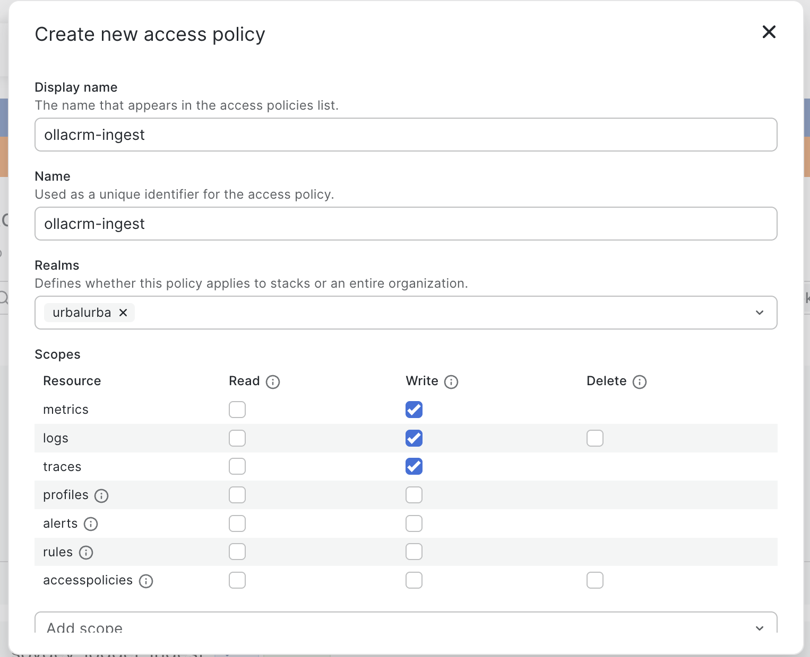

# Onboarding a new system

This is the recipe for connecting a new application to the shared Grafana Cloud stack sovdev-logger's own dashboard already reads from — written once so the third, tenth, or hundredth system to onboard doesn't need to re-derive it.

## The principle

[Why Consistent Logging Across Systems](../../general/why-consistent-logging.md) makes the case for one schema across every system. The Grafana Cloud side of that is: **one stack, one dashboard — but not one shared credential.** Every system gets its own OTLP ingest token, scoped write-only to that stack, independently revocable. All of them land in the same Loki/Prometheus/Tempo, differentiated only by `service_name` — so the dashboard's `$service_name` picker just grows a new option, with nothing about the dashboard itself needing to change. A leaked or rotated token for one system never touches another's.

## The recipe

### 1. Pick a `service_name`

Kebab-case, unique across the whole stack (e.g. `ollacrm-api`). This is the label that separates this system's data from every other system's in every panel and every query. Treat it as stable — renaming it later splits your history in two, since every past log/metric/trace keeps the old name.

### 2. Create a dedicated Access Policy + token — you do this, not an agent

Grafana Cloud portal → **Security → Access Policies → Create access policy** (this project's stack lives under the org slug `urbalurba` — the maintainer's own chosen name, not a Grafana term — so that's **https://grafana.com/orgs/urbalurba/access-policies**). The "Create new access policy" form has these fields, confirmed against a real one:

- **Display name** and **Name** (a separate "unique identifier" field, shown right below Display name) — set both to `<service-name>-ingest` (e.g. `ollacrm-ingest`); there's no reason for them to differ
- **Realms** — a multi-select dropdown, not free text. Pick this one stack (e.g. `urbalurba`) specifically, **not** "all stacks"
- **Scopes** — a table: rows are resources (`metrics`, `logs`, `traces`, `profiles`, `alerts`, `rules`, `accesspolicies`), columns are `Read`/`Write`/`Delete` checkboxes. Check only **Write** for `metrics`, `logs`, and `traces` — leave every other checkbox unchecked
- Click **Create access policy**, then on the resulting policy card click **Add token**, name it to match, and copy the value immediately — it's shown once



*Screenshot captured 2026-07-10. This is Grafana Cloud's own UI, not something this project controls — if the form looks different when you get here, Grafana Labs has redesigned it since; follow the field descriptions above rather than the exact layout.*

This step doesn't get delegated to an AI agent: minting credentials and touching access controls in the portal is a hard line this project already drew once — two separate Claude Code sessions have each independently declined to click "Create" here, even with explicit authorization.

### 3. Create a second Access Policy + token — read-only, scoped to just this system

This one is new as of 2026-07-14, needed to run [`sovdev-selftest`](../../contributor/testing/selftest-cli.md) (step 5) without handing every customer a credential that can read every *other* customer's data too.

Grafana Cloud portal → **Security → Access Policies → Create access policy** (same page as step 2 — **https://grafana.com/orgs/urbalurba/access-policies**):

- **Display name** and **Name** — `<service-name>-verify` (e.g. `ollacrm-verify`)
- **Realms** — same stack as step 2 (e.g. `urbalurba`)
- **Scopes** — check **Read** for `metrics`, `logs`, and `traces`. Leave Write/Delete unchecked everywhere.
- Once `logs` and `metrics` Read are checked, a **"Label selectors (0)"** section appears below the scopes table (collapsed by default — click it to expand). Click **Add label selector** and enter:
  ```
  service_name=~"^<service-name>.*"
  ```
  **Use the regex operator (`=~`), not exact-match (`=`).** [`sovdev-selftest`](../../contributor/testing/selftest-cli.md) writes its disposable test data under `<service-name>-selftest` (a suffix on the real name, so self-test runs never pollute the real dashboard) — an exact-match selector on just `<service-name>` won't match that, and the tool's read-back step will fail even though the write succeeded, which looks like a broken credential rather than what it actually is: a selector mismatch. Confirmed directly by hitting this exact mismatch while setting up ollacrm's own policy.
  - **Label selectors don't cover `traces`** — Grafana Cloud's own UI says so directly ("Available only with read permissions for metrics and logs"). The `traces:read` checkbox on this policy stays stack-wide regardless of the selector above — a known, accepted gap, not something to try to work around here.
- Click **Create access policy**, then **Add token** on the resulting card, name it to match, and copy the value immediately — same one-time-reveal behavior as step 2. (The policy card shows "0 tokens" until you do this — the policy alone doesn't do anything without an actual token.)

### 4. Find the OTLP endpoint and its Instance ID

From your stack's management page (**https://grafana.com/orgs/urbalurba/stacks/484308** — the number in that URL is Grafana's own stack ID, and it's the same number as the Instance ID below, confirmed), click **Configure** on the **OpenTelemetry** card. That page (`.../stacks/484308/otlp-info`) shows exactly what you need:

- **OTLP Endpoint** — one endpoint handles all three signals: `https://otlp-gateway-prod-eu-west-0.grafana.net/otlp` for this stack (region varies by stack, don't assume `eu-west-0`)
- **Instance ID** — shown directly on this page (`484308` for this stack)

This Instance ID is specific to OTLP ingestion; it's a *different* Instance ID than Loki, Tempo, or Prometheus each have on their own connection pages (reachable from the same stack management page, one card per signal) — confirmed non-uniform, don't assume a shared pattern or reuse another signal's ID here.

The same page also offers to generate a token directly ("Password / API Token — Generate now") — that's a separate, simpler path than the Access Policy in step 2, but skip it: it doesn't give you the scoped, independently-named, independently-revocable token this recipe is built around. Use the Access Policy token from step 2 as the password instead.

### 5. Configure the new system — the standard env var set

Two groups of variables, covering both consumption points every new customer needs. **This is the canonical template — the same one for every system, third or hundredth.**

**Group 1 — the application's own OTLP export** (six standard OpenTelemetry variables, the same regardless of language or framework):

```bash
OTEL_SERVICE_NAME=<service-name>
OTEL_EXPORTER_OTLP_LOGS_ENDPOINT=<otlp-endpoint>/v1/logs
OTEL_EXPORTER_OTLP_METRICS_ENDPOINT=<otlp-endpoint>/v1/metrics
OTEL_EXPORTER_OTLP_TRACES_ENDPOINT=<otlp-endpoint>/v1/traces
OTEL_EXPORTER_OTLP_HEADERS="Authorization=Basic <base64(instance-id:token)>"
OTEL_EXPORTER_OTLP_PROTOCOL=http/protobuf
```

Compute the Basic Auth value with the OTLP Instance ID from step 4 and the **ingest** token from step 2:

```bash
echo -n "<otlp-instance-id>:<service-name-ingest-token>" | base64
```

The header value **must stay quoted** wherever it's stored or sourced — `Authorization=Basic <token>` contains a space, and anything that word-splits on spaces (bash's `source`, for one) silently truncates it after the space, producing a confusing `401` with no useful error about why.

**Group 2 — `sovdev-selftest`'s own config** (for the customer to self-verify their setup on demand, per [Quick check: sovdev-selftest](../../contributor/testing/selftest-cli.md)). Exact variable names required by the shipped CLI (`typescript/src/cli/backend-config.ts`) — get these wrong and the tool fails fast with a "missing env vars" message rather than silently misbehaving:

```bash
GRAFANA_CLOUD_INGEST_TOKEN=<same ingest token as Group 1, un-base64'd>
GRAFANA_CLOUD_VERIFY_TOKEN=<the verify token from step 3>
GRAFANA_CLOUD_OTLP_ENDPOINT=<otlp-endpoint>
GRAFANA_CLOUD_OTLP_INSTANCE_ID=<otlp-instance-id>
GRAFANA_CLOUD_LOKI_URL=<Loki query host, e.g. https://logs-prod-eu-west-0.grafana.net>
GRAFANA_CLOUD_LOKI_INSTANCE_ID=<Loki's own Instance ID>
GRAFANA_CLOUD_PROMETHEUS_URL=<Prometheus/Mimir query host>
GRAFANA_CLOUD_PROMETHEUS_INSTANCE_ID=<Prometheus's own Instance ID>
```

Loki's and Prometheus's Instance IDs are each **different** from the OTLP one and from each other — find them on their own connection pages, reachable from the same stack management page as step 4 (one card per signal). Don't assume they match the OTLP Instance ID just because this stack's OTLP Instance ID happens to equal the stack ID.

Both groups contain real credentials (`OTEL_EXPORTER_OTLP_HEADERS`, `GRAFANA_CLOUD_INGEST_TOKEN`, `GRAFANA_CLOUD_VERIFY_TOKEN`) — see step 7.

### 6. Validate the tokens actually work — before wiring anything into the real system

Don't skip this. A portal saying "access policy created" and an SDK printing "flushed successfully" both prove nothing on their own — this project already found a real bug once where console output claimed success while data silently never arrived (see [`INVESTIGATE-long-running-server-flush.md`](../../ai-developer/plans/completed/INVESTIGATE-long-running-server-flush.md)). The only real proof is a readback that actually finds the data.

With both groups of variables from step 5 in place, run [`sovdev-selftest`](../../contributor/testing/selftest-cli.md) (bundled with the npm package, `npx sovdev-selftest --backend grafana-cloud`) — it writes a disposable, uniquely-marked log and metric under `<service-name>-selftest`, then reads both back automatically, reporting a clean pass/fail per signal rather than one opaque result. This uses the customer's own `<service-name>-verify` token from step 3, not a shared maintainer credential — every customer's self-test stays isolated to their own data, matching the whole point of minting a separate verify policy per system.

Confirm all four checks (write-log, write-metric, read-log, read-metric) pass — not just that the command exits without a stack trace — before moving on.

### 7. Treat every credential as a real secret

`OTEL_EXPORTER_OTLP_HEADERS`, `GRAFANA_CLOUD_INGEST_TOKEN`, and `GRAFANA_CLOUD_VERIFY_TOKEN` all contain tokens from steps 2–3. Store all three in whatever secret manager the new system's own deploy pipeline already uses for real secrets — never as plain environment variables alongside identifiers like `OTEL_SERVICE_NAME` or the various `*_URL`/`*_INSTANCE_ID` values, which are plain identifiers and can live as ordinary env vars/config.

### 8. Verify it shows up in the real system

Once the new system is actually wired up (not the throwaway validation from step 6) and has generated at least one real log call, open the dashboard — the new `service_name` appears automatically in the `$service_name` picker (multi-select, "All" selected by default) and in every panel's legend. Nothing about the dashboard changes: this is exactly what its template variable and per-peer-service panels were built for. See [Dashboard walkthrough](../dashboard-walkthrough/index.md) for what each panel means once you're looking at it.

## What you're *not* doing

- **Not** creating a new dashboard — the existing one already generalizes to any number of services.
- **Not** creating a new Grafana Cloud stack — one stack, one retention budget, one place to look.
- **Not** sharing a credential across systems — every system gets its own independently-revocable token, so a leaked token doesn't hand over every system's credentials at once. **This contains read access only** (each system's verify token is LBAC-scoped to just its own `service_name`, confirmed directly) — **it does not prevent a leaked ingest token from writing fabricated data under a different system's `service_name`**. Grafana Cloud's Label-Based Access Control only restricts read scopes, never write scopes (confirmed directly — see [Testing against Grafana Cloud](../../contributor/testing/grafana-cloud.md)'s "Known limitation: write tokens aren't service_name-restricted"). Treat every ingest token as capable of writing anywhere in the shared stack if it leaks, not just its own system.

## Experience reports

Real systems that have gone through this recipe, with the exact snippets that made it concrete:

- [ollacrm](ollacrm/index.md) — a TypeScript/Hono service on Cloud Run, sovdev-logger's first external consumer

## See also

- [Why Consistent Logging Across Systems](../../general/why-consistent-logging.md) — the philosophy behind this recipe
- [Dashboard walkthrough](../dashboard-walkthrough/index.md) — what each panel shows once data arrives
- [Observability architecture](../observability-architecture.md) — the local-UIS side of dashboard setup
- [Testing against Grafana Cloud](../../contributor/testing/grafana-cloud.md) — how sovdev-logger's own E2E tests use this same stack, for verification rather than a production system
- [Quick check: sovdev-selftest](../../contributor/testing/selftest-cli.md) — the CLI used in step 6, and the full design behind it
